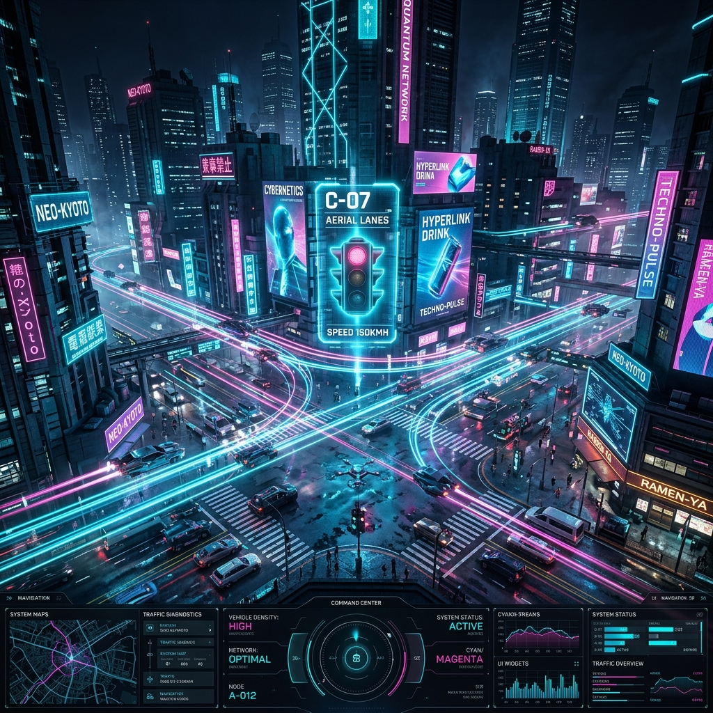

<div align="center">


<br/>


<br/>

[](https://Paradoxai77.github.io/Traffic-System/)
[](https://github.com/Paradoxai77/Traffic-System/stargazers)
[](https://react.dev)
[](https://vitejs.dev)
[](https://flask.palletsprojects.com)
[](./LICENSE)

<br/>

> **⚡ An intelligent, cyberpunk-themed smart city traffic management platform powered by Edge AI — delivering real-time congestion analytics, automated ANPR violation detection, emergency vehicle preemption (EVP), and environmental CO₂ monitoring from a single command-and-control dashboard.**

<br/>

---

</div>

## 📸 Dashboard Preview

<div align="center">

| Real-time Analytics | Node Topology | ANPR Detection |
|---|---|---|
| 🟢 Live congestion area charts | 🔵 Emergency EVP override | 🔴 Plate recognition + fine |
| AI-predicted traffic stability | Multi-node signal control | 98.4% confidence scoring |

</div>

---

## ✨ Features

<table>
<tr>
<td width="50%">

### 🧠 Edge AI Intelligence
- Real-time **vehicle density prediction**
- AI-powered **anomaly & incident detection**
- ML confidence scoring per event
- Automated **emergency escalation**

### 📷 ANPR Surveillance
- Automatic **Number Plate Recognition**
- Over-speeding detection with speed readings
- Per-vehicle fine generation
- Live CCTV feed with AI tracking overlay

</td>
<td width="50%">

### 🚨 Emergency Vehicle Preemption (EVP)
- Instant **signal override** for emergency vehicles
- Cross-intersection topology control
- Real-time pedestrian + vehicle occupancy count
- Wait-time optimization per node

### 🌿 Environmental Monitoring
- Live **CO₂ emissions saved** tracker
- Average traffic flow speed (km/h)
- Weather condition integration
- Total vehicles scanned counter

</td>
</tr>
</table>


---

## 🏛️ Jurisdiction & Enforcement Protocols

Ruby Traffic AI is specifically calibrated for the **Pune, Maharashtra (MH-12)** jurisdiction, integrating strict legal and geographic frameworks directly into its decision engine.

### 📍 Pune Smart City Deployment
- **Geofencing:** Active enforcement within a 500-meter radius of the Pune Command Center (Lat: `18.5204`, Lng: `73.8567`).
- **Nodes Monitored:** Shaniwar Wada, Koregaon Park, Hinjewadi Phase 1, Swargate.
- **Traffic Modeling:** Adapts to Pune's unique density patterns and peak-hour vehicle flow.

### 📜 System Enforcement Modules
The platform operates on a rigid 3-module framework designed for Zero-Tolerance accuracy:

*   **Module 1: Boundary & Core Challan Engine:** Validates Haversine distance, timestamp integrity, and AI confidence thresholds (>98% plate, >95% violation) before generating a valid challan.
*   **Module 2: Plate Identification & HSRP:** Scans for 10-digit HSRP laser barcodes. Automatically flags non-compliant plates (VP-02) and cloned plates (IPC 467/471) for human verification.
*   **Module 3: Maharashtra Operations:** Enforces localized rules such as out-of-state immunity for certain HSRP checks and elevated baseline fines (₹10,000) for repeat offenders within 30 days.

> **Note:** The platform includes an interactive **Evidence Capture** module for Non-HSRP plates, allowing officers to verify AI-highlighted missing barcodes before issuing final challans.

---

## 🏗️ Architecture

<div align="center">
  
</div>

<br/>

<details>
<summary><b>🔍 View Technical Architecture Details</b></summary>
<br/>

The system is built on a distributed **Edge-to-Cloud architecture**:
- **Frontend (Command Center):** React 19 + Vite 8 dashboard providing real-time data visualization via Recharts.
- **Backend (API Gateway):** Python Flask REST API securely handling data bridging and historical logging.
- **Edge Sandbox:** Self-contained edge simulation generating probabilistic traffic density, ANPR events, and emergency alerts.

</details>

---

## 🚀 Quick Start

### Prerequisites

| Tool | Version |
|---|---|
| Node.js | `≥ 18.x` |
| Python | `≥ 3.10` |
| npm | `≥ 9.x` |

### 1️⃣ Clone & Install

```bash
# Clone the repository
git clone https://github.com/Paradoxai77/Traffic-System.git
cd Traffic-System

# Install frontend dependencies
npm install
```

### 2️⃣ Start the Backend (Optional — live data mode)

```bash
cd backend
pip install -r requirements.txt
python app.py
```

> 💡 If no backend is running, the dashboard automatically falls back to a **built-in Edge AI sandbox simulation** — no setup needed!

### 3️⃣ Launch the Dashboard

```bash
npm run dev
```

Open your browser at **`http://localhost:5173`** 🎉

---

## 📦 Tech Stack

<div align="center">

| Layer | Technology | Purpose |
|---|---|---|
| **Frontend** | React 19 + Vite 8 | UI framework & bundler |
| **Charts** | Recharts | Real-time area charts |
| **Icons** | Lucide React | Cyberpunk icon set |
| **Styling** | Vanilla CSS + Glassmorphism | Dark mode & animations |
| **Backend** | Python Flask | REST API data server |
| **Deployment** | GitHub Pages + GH Actions | CI/CD pipeline |

</div>

---

## 🧩 Project Structure

```
Traffic-System/
├── 📁 src/
│   ├── App.jsx          # Main dashboard component
│   ├── App.css          # Cyberpunk component styles
│   ├── index.css        # Global CSS design system
│   └── main.jsx         # React entry point
├── 📁 backend/
│   └── app.py           # Flask REST API server
├── 📁 public/
│   └── cctv.png         # CCTV feed asset
├── 📁 .github/
│   └── workflows/
│       └── deploy.yml   # GitHub Actions CI/CD
├── index.html           # HTML entry point
├── vite.config.js       # Vite configuration
└── package.json         # Project manifest
```

---

## 🌐 Deployment

The project is automatically deployed to **GitHub Pages** via GitHub Actions on every push to `main`.

```yaml
# Triggered on push to main
name: Deploy Ruby Traffic AI
on:
  push:
    branches: [main]
```

**Live URL:** [`https://Paradoxai77.github.io/Traffic-System/`](https://Paradoxai77.github.io/Traffic-System/)

---

## 📊 Dashboard Panels

| Panel | Description |
|---|---|
| **KPI Cards** | Total tracked vehicles, avg flow speed, violations logged, critical alerts |
| **Congestion Analytics** | Real-time area chart with 20-point rolling history and CO₂ savings |
| **CCTV AI Feed** | Live camera overlay with ANPR bounding boxes and violation badges |
| **Node Topology** | Intersection-by-intersection density, wait times, and traffic signal status |
| **Anomaly Incident Log** | AI-detected events with model confidence and automated action taken |

---

## 🤖 Edge AI Simulation

When the Flask backend is offline, the frontend runs a **fully self-contained edge simulation**:

- 📍 **4 smart intersections** — Main Station, 5th Avenue, Broadway, Park Row
- 🔁 **Polling every 2 seconds** — density fluctuates ±7% per cycle
- 🚨 **EVP events** auto-trigger when wait time exceeds 40s
- 📸 **ANPR violations** generated probabilistically (20% chance per cycle)
- 🌿 **CO₂ savings accumulate** at 2 kg per tick

---

## 🛠️ Scripts

```bash
npm run dev        # Start local development server
npm run build      # Build for production (outputs to /dist)
npm run preview    # Preview production build locally
npm run lint       # Run ESLint on all source files
```

---

## 🤝 Contributing

Contributions are welcome! Here's how to get started:

1. **Fork** the repository
2. Create a feature branch: `git checkout -b feature/amazing-feature`
3. Commit your changes: `git commit -m 'feat: add amazing feature'`
4. Push to the branch: `git push origin feature/amazing-feature`
5. Open a **Pull Request**

---

## 📄 License

This project is licensed under the **MIT License** — see the [LICENSE](./LICENSE) file for details.

---

<div align="center">

**Built with ❤️ for Smart City Innovation**

[](https://github.com/Paradoxai77)


</div>
